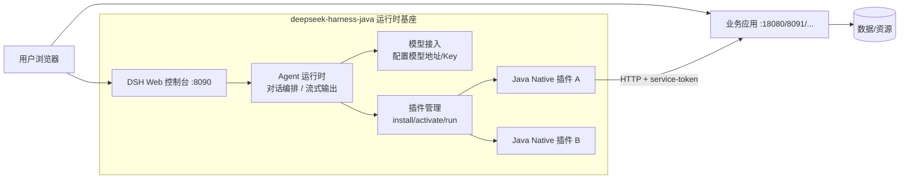
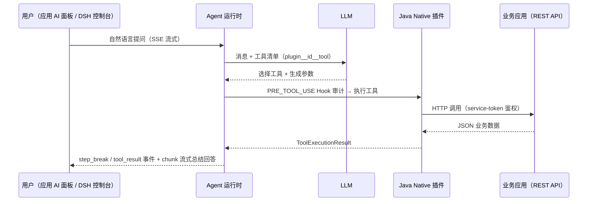

# dsh-java-plugin-skills

AI Agent 技能包：帮助你**快速完成 deepseek-harness-java（DSH，Java Agent 运行时基座）与业务应用的智能体对接**。

支持两种典型场景：

1. **已有应用** → 为应用开发一个 Java Native 插件，注册工具到 DSH Agent，让 AI 能调用应用能力
2. **没有应用** → 按诉求从零开发一个 Java 应用（业务系统 + 内嵌 AI 助手 + DSH 插件），再以插件方式接入 DSH

最终交付：**探活确认可访问的** DSH 地址 + 应用地址 + 插件安装激活完成 + 体验流程说明 + 完善的工程 README（含简历/面试沉淀），每个插件工具全链路实测通过。

## 使用说明

- **这是什么**：一个面向 DSH Java 的技能包，用一句话或案例编号即可生成业务应用 + Java Native 插件。
- **怎么用**：直接告诉助手你的需求，或从 104 个案例里选一个；技能会完成生成、启动、插件安装与验证。
- **适合谁**：想快速搭建业务系统、演示 AI 能力、或沉淀项目材料的人。
- **前置条件**：JDK 17+ 与 Maven 3.9+，本机 8090/18081 等端口空闲。

## 快捷体验流程

1. 安装并启用本技能。
2. 执行 `bash <skill_path>/scripts/check_env.sh` 检查 JDK/Maven。
3. 执行 `bash <skill_path>/scripts/start_harness.sh` 启动 DSH。
4. 对助手说：`就做 P1` 或直接描述需求。
5. 按交付 README 打开应用地址，登录后右下角问 AI；再到 DSH 控制台验证工具调用。

### 示例：P1 Digital Mall

- 仓库：<https://github.com/deepseek-harness-java/digital-mall>
- 商城：<http://127.0.0.1:18080>
- DSH：<http://127.0.0.1:8090>
- 账号：`customer-1 / 123456`

**AI 对话案例**

```text
问：推荐两款适合通勤的数码产品，并说明为什么。
答：为你挑了两款很适合通勤的数码产品：Sonic Air 4 降噪耳机（¥749，库存 58）和 Nova X14 轻薄笔记本（¥5999，库存 24）。前者更适合把地铁调成静音，后者更适合边通勤边办公。
```


## 它能做出什么项目

### 三种交付形态

| 形态 | 产出 | 适合 |
|---|---|---|
| **应用 + DSH 插件** | `xxx-app`（业务应用）+ `xxx-plugin`（插件），AI 在 DSH 对话中能查数据、做操作 | 标准玩法，AI 智能体全链路 |
| **仅独立应用** | 只生成 `xxx-app`，功能照常能用，与 DSH 无关 | 只要业务系统本身 |
| **先设计 + 原型** | 实体表、工具清单、页面原型，确认后再开发 | 想先对齐方向 |

### 99 个开箱即用案例（覆盖 48 个领域分类）

对助手说一句案例编号或名称（如「就做 P23」），即可一句话完成开发、部署、启动：

```
商城零售   P1 数码商城 · P2 生鲜团购        新闻资讯   P22 财经早报
金融信贷   P3 记账助手 · P4 信贷模拟器      智能硬件   P23 家居中控
出行配送   P5 出行规划 · P6 外卖订餐        创作工具   P24 自媒体工作台
生活服务   P7 探店点评                     农业乡村   P25 智慧农场
项目协作   P8 团队看板                     环保公益   P26 碳普惠
营销增长   P9 活动工厂                     科技前沿   P27 AI 监控台
社交社区   P10 兴趣广场                    ── 工程效能（产/研/测/运维）──
医疗健康   P11 在线问诊 · P12 健身私教      数据运维   P28 Redis 监控 · P29 ES 运维
教育学习   P13 在线课程 · P14 单词背诵      发布交付   P30 发布监控 · P34 值班巡检
咨询服务   P15 IT 工单                     研发提效   P31 研发协作 · P33 需求工作台
政务公共   P16 办事大厅                    质量保障   P32 测试用例
内容文旅   P17 研学旅游 · P18 阅读笔记      ── 角色与行业平台 ──
工具效率   P19 会议纪要 · P20 订阅管理      教师教育   P35 教师工作台
娱乐内容   P21 音乐歌单                    学科学习   P36 数学思维 · P37 语文读写 · P38 英语听说
                                          销售商务   P39 销售工作台
                                          专业服务   P40 医生工作站 · P41 律师工作台 · P42 招聘工作台
                                          ── 行业纵深与生活服务 ──
                                          物流出行   P43 快递查件 · P44 酒旅预订
                                          企业内勤   P45 财务报销 · P51 供应链采购
                                          保险金融   P46 保险理赔
                                          制造行业   P47 MES 生产看板
                                          社区生活   P48 物业报修 · P49 宠物医院
                                          汽车服务   P50 汽车养护
                                          房产中介   P52 房源工作台
                                          ── 扩展场景 ──
                                          消费文旅   P53 二手交易 · P54 积分商城 · P55 直播复盘
                                          门店经营   P56 餐厅经营台 · P57 景区导览
                                          策划票务   P58 婚庆策划 · P59 民宿房东 · P60 演出票务
                                          能源出行   P61 充电站 · P62 车队调度 · P63 光伏运维 · P64 航班动态
                                          家庭财富   P65 投资看板 · P66 资产配置 · P67 众筹项目
                                          健康管理   P68 体检报告 · P69 慢病管理 · P70 心理咨询预约
                                          教务培训   P71 教务排课 · P72 企业培训 · P73 留学申请
                                          企业中台   P74 知识库 · P75 OKR · P76 IT资产 · P77 合同台账
                                          舆情商务   P78 舆情监测 · P79 招投标 · P80 客服质检
                                          政务治理   P81 热线分析 · P82 网格员 · P83 志愿者
                                          垂直行业   P84 ESG · P85 实验室 · P86 工地安全 · P87 冷链 · P88 水质
                                          更多角色   P89 导游 · P90 房东 · P91 营养师 · P92 自由职业
                                                     P93 电竞复盘 · P94 琴行 · P95 宠物寄养 · P96 装修
                                                     P97 团购团长 · P98 图书馆 · P99 摄影约拍
```

**精选案例长什么样**（每个应用 = 业务主界面 + 右下角 AI 助手面板 + 3~6 个 Agent 工具）：

| 案例 | 应用形态 | AI 能力亮点 |
|---|---|---|
| P1 数码商城 | 商品网格 + 购物车 + 订单物流 | 跨「商品/订单/物流」多工具联动：对比推荐、订单追踪一句话完成 |
| P6 外卖订餐 | 餐厅卡片 + 菜单 + 骑手位置模拟 | 按口味跨餐厅推荐、凑单建议、写操作下单前先复述确认 |
| P32 测试用例工作台 | 需求追溯矩阵 + 计划执行 + 缺陷列表 | 「需求改了要回归哪些用例」→查追溯矩阵→圈定回归范围→生成执行计划 |
| P35 教师工作台 | 学情热力图 + 作业批改 + 备课资源 | 「月考哪里薄弱」→查热力图→定位高频错题→生成分层练习包 |
| P30 发布监控台 | 发布单 + 指标对比 + 一键回滚 | 「要不要放量」→对比发布前后指标→给放量/回滚建议（回滚需确认） |
| P41 律师工作台 | 案件列表 + 期限提醒 + 合同审查 | 「本周有什么时限」→按紧急排序→关联案件给准备清单（带免责声明） |
| P23 家居中控 | 房间分区设备卡 + 能耗图表 | 读传感器数据做联动决策：「卧室太干」→查湿度→生成睡前场景 |

**案例库之外的领域**：按「Prompt 结构公式」即时生成同结构案例（业务实体 + AI 工具 + 前端 + AI 助手），同样一句话可执行——这套技能不挑领域，从 toC 生活场景到 toB 工程效能、再到教师/医生/律师等专业角色平台都覆盖。

### 已落地的完整案例

| 案例 | 位置 | 说明 |
|---|---|---|
| 2D Weekend Mall 智能客服商城 | `references/case-2d-weekend-mall.md` | 旗舰标杆：商品/订单/物流 5 工具，端口 18080 |
| MySQL 运维平台 | `references/case-dsh-java-mysql.md` | 管理后台型：库表巡检/慢 SQL 分析，端口 8091 |
| 外卖订餐平台 | 实战交付案例 | 5 工具全链路实测，沉淀 8 条环境坑位（SERVER_PORT 劫持、插件热更新等） |

## 启动后的浏览地址

| 服务 | 地址 | 能看到什么 |
|---|---|---|
| DSH 控制台 | http://127.0.0.1:8090 | Agent 对话（SSE 流式）、插件管理（安装/激活）、模型设置 |
| 智能客服商城（案例） | http://127.0.0.1:18080 | 商品网格 + 购物车 + AI 购物助手面板 |
| MySQL 运维平台（案例） | http://127.0.0.1:8091 | 管理后台 + 只读运维工具对话 |
| 新开发的应用 | http://127.0.0.1:18081 起 | 业务主界面 + 右下角 AI 助手面板 |

> 具体项目的真实地址以该项目交付 README 为准（交付前逐一探活 HTTP 200 才写进去）；默认模型渠道已预配置，DSH 启动即可对话。

## 交付产物总结（项目开发完成后你会得到）

| # | 产物 | 说明 |
|---|---|---|
| 1 | **可运行业务应用** | `xxx-app` Spring Boot jar：业务主界面 + 内嵌 AI 助手面板（代理 DSH 流式接口），预置细腻度验收过的演示数据 |
| 2 | **Java Native 插件** | `xxx-plugin` jar：3~6 个 Agent 工具（读/写分离，写操作带确认机制），已在 DSH 安装激活（ACTIVE） |
| 3 | **可访问地址** | DSH 8090 + 应用端口，交付前刚刚探活确认，附服务生命周期说明（404 时如何重启） |
| 4 | **验证记录** | 每个工具 ≥1 条自然语言实测（`agent_stream.sh` 输出工具调用轨迹）、边界拒绝用例、算术一致性校验、真实浏览器 UI 走查 |
| 5 | **工程 README** | 一句话需求、服务地址、插件信息与工具清单、体验流程说明、预置数据说明、构建启动命令、环境坑位记录 |
| 6 | **简历/面试材料** | STAR 项目模板 + 技术关键词 + 高频面试 7 问与答题要点（见下文） |

## 工作流程（六阶段）

```
阶段 0 澄清需求   → 已有应用 or 新项目？交付形态三选一（可从 104 案例菜单选）
阶段 1 环境准备   → check_env.sh，缺 JDK 17/Maven 给安装指引
阶段 2 启动 DSH   → start_harness.sh，8090 控制台配模型
阶段 3 开发应用   → 场景深挖（实体表→工具表→页面→预置数据）→ 设计稿确认 → 写码
阶段 4 验证交付   → install_plugin.sh → 逐工具 agent_stream.sh 实测 → delivery_check.sh → 真实浏览器 UI 验证
阶段 5 文档沉淀   → 工程 README + 简历 STAR 模板 + 技术关键词 + 面试重点
阶段 6 验收迭代   → 索要验收反馈，小改轻回归 / 大改全流程，跨会话断点续作
```

## 目录结构

```
dsh-java-plugin-skills/
├── SKILL.md                          # 技能入口（工作流程、核心概念、Gotchas）
├── scripts/                          # 可执行脚本
│   ├── check_env.sh                  # 环境检查（JDK 17+ / Maven，缺失时提示安装方式）
│   ├── start_harness.sh              # 启动 DSH（端口探测 + 防 SERVER_PORT 劫持/代理 502）
│   ├── install_plugin.sh             # 安装 + 激活插件（curl 调 install/activate 接口）
│   ├── smoke_test.sh                 # 冒烟验证（检查服务、插件列表）
│   ├── agent_stream.sh               # Agent 端到端流式调用（工具轨迹 + 最终回答，交付前必用）
│   ├── delivery_check.sh             # 最终交付自动化检查（探活/插件状态/鉴权回归）
│   └── deploy_remote.sh              # 云服务器一键部署（上传 JAR → 远端重启脚本 → 探活）
├── runtime/
│   └── deepseek-harness-java-app.jar # DSH 宿主可执行 JAR（已带默认模型渠道，可直接端到端验证）
└── references/                       # 参考文档（渐进式披露，按需加载）
    ├── plugin-dev-guide.md           # 插件开发全流程（含完整代码骨架，从真实案例提炼）
    ├── ui-design-guide.md            # UI 设计指南（design tokens、分域设计语言表、无 AI 味清单、AI 面板规范、md 渲染）
    ├── prompt-recipes.md             # 99 案例储备库 + 场景深挖卡片 + 细腻度规范
    ├── runtime-pitfalls.md           # 运行环境坑位与端到端验证指南
    ├── delivery-checklist.md         # 最终交付清单（自动化项 + 手工项 + 回归矩阵）
    ├── readme-delivery-template.md   # README 交付模板 + 简历项目模板
    ├── deploy-guide.md               # 启动部署指南（本地 / 服务器 / 无 Java 环境）
    ├── architecture.md               # 架构图与说明（含 Mermaid，可直接渲染或转图）
    ├── case-2d-weekend-mall.md       # 案例：智能客服商城（端口 18080）
    ├── case-dsh-java-mysql.md        # 案例：MySQL 运维平台（端口 8091）
    └── interview-notes.md            # 面试资料
```

## 快速开始

```bash
# 1. 环境检查（JDK 17+ / Maven）
bash scripts/check_env.sh

# 2. 启动 DSH（默认端口 8090）
bash scripts/start_harness.sh

# 3. 开发应用与插件（参考 references/plugin-dev-guide.md）
#    Maven 多模块：xxx-app + xxx-plugin，mvn package -DskipTests 构建

# 4. 安装并激活插件，冒烟验证
bash scripts/install_plugin.sh <plugin_jar路径> <pluginId> <版本> <入口Jar文件名>
bash scripts/smoke_test.sh

# 5. 交付前：逐工具端到端实测 + 交付检查
bash scripts/agent_stream.sh
bash scripts/delivery_check.sh <pluginId>
```

启动后打开 `http://127.0.0.1:8090`，「设置 → 模型设置 → 添加模型」配置模型地址/名称/API Key，否则 Agent 无法对话。

## 核心概念

DSH 是 Java Agent 运行时基座（端口 8090），提供 Web 控制台、Agent 对话、模型配置、插件管理。插件是 **Java Native Plugin**：

- 插件 JAR 依赖 `cn.xiaofuge:deepseek-harness-java-types:0.1.5`（scope=**provided**，宿主提供）
- 继承 `AbstractHarnessPlugin`，在 `tools()` 中返回 `ToolDefinition` 列表（工具继承 `AbstractTool`，实现 `name/description/parameters/run`）
- 在 `configure(PluginContext)` 中注册系统提示词与 Hook（如 `PRE_TOOL_USE` 审计）
- 必须提供 `META-INF/plugin.yaml`（id/name/version/entrypoint）和 SPI 声明文件 `META-INF/services/cn.xiaofuge.deepseek.harness.domain.spi.JavaHarnessPlugin`
- 工具在 Agent 中以 `plugin__<pluginId>__<toolName>` 命名暴露
- 插件通过 HTTP 调用业务应用 API（不直接持有业务资源，注意超时/异常分类/脱敏）

架构：**DSH Agent（8090）→ 插件（对接器）→ 业务应用（HTTP）**，完整分层职责与关键机制见 `references/architecture.md`。

## 架构图



## 流程图（一次 AI 对话的工具调用链路）



## 简历与面试沉淀

### 简历项目模板（STAR，3~5 行可直接粘贴）

```markdown
**<项目名>（<年份>）** — 个人全栈项目 | 技术栈：Java 17 / Spring Boot 3.x / Maven 多模块 / 原生前端
- 基于 Java Agent 运行时基座（DeepSeek Harness），以 **Java Native Plugin（SPI + 类加载隔离）** 方式
  为业务应用扩展 AI 能力，注册 <N> 个 Agent 工具（读 <M> 写 <K>），由 LLM 按语义自主编排调用
- 设计 <插件-应用 HTTP 边界 + service-token 鉴权 + PRE/POST 工具审计 Hook + 写操作人工确认>，
  兼顾能力开放与安全边界
- 实现 SSE 流式对话、种子数据算术一致、端到端自动化验证脚本；<一个具体业务成果，带数字>
```

要点：数字具体（几个工具/模块/指标）、机制写清（插件怎么接入、安全边界在哪）、避免空话。

### 技术关键词（按真实使用勾选）

| 层 | 关键词 |
|---|---|
| 运行时/语言 | Java 17、Spring Boot 3.x、Maven 多模块、SPI（ServiceLoader）、类加载隔离 |
| AI/Agent | Function Calling、Agent 工作流、系统提示词工程、工具 description 设计、SSE 流式、PRE/POST Hook 审计 |
| 工程 | REST API、种子数据设计、端到端验证、插件生命周期（install/activate/deactivate） |
| 安全 | service-token 服务间鉴权、最小权限边界、写操作确认机制 |

### 高频面试 7 问（答题要点）

| # | 问题 | 答题要点 |
|---|---|---|
| 1 | 插件怎么被宿主加载？ | SPI（`META-INF/services` + ServiceLoader）发现入口 → 独立类加载器加载 fat jar（依赖 scope=provided 防冲突）→ `plugin.yaml` 元数据 → install/activate 生命周期 |
| 2 | Agent 怎么知道有哪些工具、何时调用？ | `tools()` 返回 ToolDefinition（name/description/JSON Schema），以 `plugin__<id>__<tool>` 注入模型；**description 质量决定调用准确率** |
| 3 | 如何防止 AI 乱写数据？ | 写工具 description 声明风险 + 系统提示词硬规则（先确认参数）+ `isConcurrencySafe=false` + approvalMode + PRE/POST Hook 审计 |
| 4 | 插件为什么不直连数据库？ | 安全边界：只经业务应用 HTTP API（service-token）访问，应用保留业务校验与审计单一入口；插件可独立升级 |
| 5 | SSE 流式怎么实现？ | 服务端 SseEmitter，事件 meta/chunk/reasoning/step_break/tool_result/finish/done/error；客户端 fetch 解析 `event:`/`data:` 行；心跳保活 |
| 6 | 怎么保证演示数据可信？ | 真实品牌/价格区间/数据故事，汇总由明细实时计算保证算术一致；脚本做"汇总=逐条加总"校验 |
| 7 | 怎么验证 AI 真的调了工具？ | 看 SSE step_break/tool_result 事件的 toolName 与 result，核对回答数字与工具返回一致（`agent_stream.sh` 自动化） |

> 完整模板与深度追问兜底：`references/readme-delivery-template.md`（README/简历/面试模板）、`references/interview-notes.md`（面试资料全集）。

## 关键 Gotchas

- 插件依赖 scope 必须 `provided`，否则 fat jar 与宿主类冲突加载失败
- `plugin.yaml` 的 `entrypoint` 是**插件主类全限定名**，而 install 接口的 `entrypoint` 字段是 **JAR 文件名**，两者不同
- install 接口 `sourcePath` 必须是宿主可访问的**绝对路径**
- 修改插件配置（如 mall.service-token）后需停用再启用插件，`configure()` 才会重新执行
- 工具 description 直接影响 Agent 调用准确性：写清「何时必须调用、何时不要调用、返回什么」
- 插件不直连数据库等敏感资源，通过业务应用 Admin API 走 HTTP，守住安全边界
- DSH 未配置模型时对话报错，先检查「设置 → 模型设置」
- 端口约定：DSH 8090；案例应用 18080（商城）/ 8091（MySQL 平台），新应用 18081 起顺延
- 沙箱/受限代理环境的 SERVER_PORT 劫持、HTTP_PROXY 502、进程回收等坑，见 `references/runtime-pitfalls.md`
- 生成前端时 AI 气泡必须做 markdown 渲染（`renderMd` 渲染器见 `references/ui-design-guide.md` 第五节），禁止 `textContent` 裸显模型回复

## 安装技能

```bash
# WorkBuddy
cp -r dsh-java-plugin-skills ~/.workbuddy/skills/

# Claude Code
cp -r dsh-java-plugin-skills ~/.claude/skills/

# OpenClaw
cp -r dsh-java-plugin-skills ~/.qclaw/skills/

# OpenAI Codex
cp -r dsh-java-plugin-skills ~/.codex/skills/
```

## 许可证

Apache-2.0
